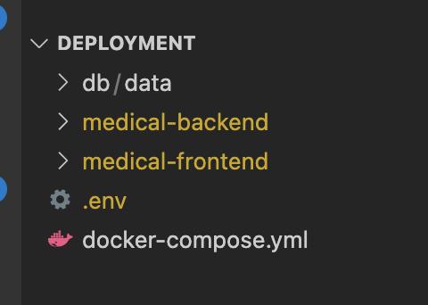
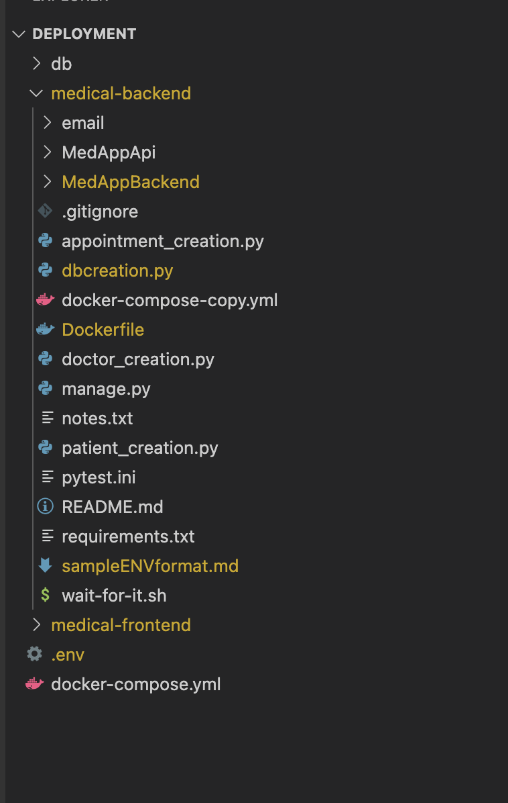
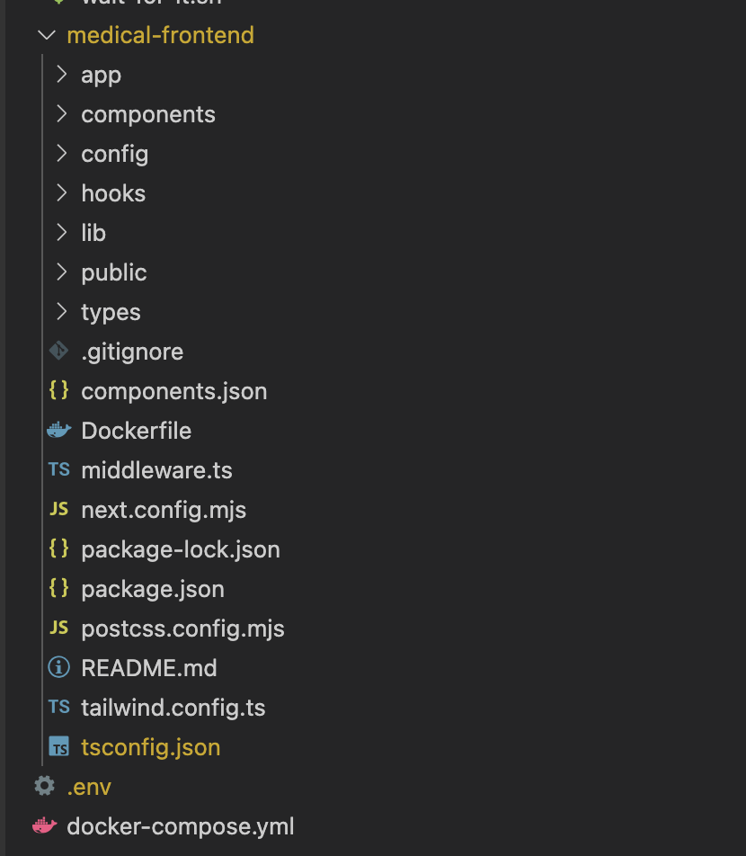

## .env format - Docker Deployment
```python
MYSQL_DATABASE=medicalapp
MYSQL_ROOT_PASSWORD=***** # Assign a root password
DJANGO_SECRET_KEY=***** # Replace with a secure key
MYSQL_USER=root
MYSQL_HOST=db
EMAIL_HOST_USER=medicalbackend@gmail.com
EMAIL_HOST_PASSWORD=********** # Replace with the password
DJANGO_SETTINGS_MODULE=MedAppBackend.settings
```

# Docker Deployment Instructions for MedApp (Locally)

## Prerequisites
1. **Environment Variables**: Ensure variables are properly referenced in `settings.py` for database access. We use `load_dotenv` and `os.getenv` to load variables from the `.env` file.
2. **Docker Desktop**: Ensure Docker Desktop is installed and running. [Download Docker Desktop here](https://www.docker.com/products/docker-desktop/). You'll need to create an account and logged in. 

## Setting up the Project
1. **Directory Structure**:
   - Pull the `medical-backend` and `medical-frontend` repositories into the same root directory.
   - Create a folder named `db` in the root directory and add an empty `data` subfolder inside.

2. **Docker Compose File**:
   - Move or copy `docker-compose-copy.yaml` to the root directory.
   - Rename it to `docker-compose.yaml`.

3. **Environment File (.env)**:
   - Add a `.env` file to the root directory following the provided format. Ensure all necessary environment variables are defined.
  
4. Images of folder structure are shown below

## Docker Commands
Navigate to the root directory where the `docker-compose.yaml` file is located and run the following commands:

### Start the Application
```bash
docker-compose up --build
```

###  Stop the Application
```bash
docker-compose down
```

### View Running Containers
```bash
docker ps
```
### Restart the Application
```bash
docker-compose restart
```
### Access Logs for Services
  Replace <service_name> with backend or frontend as needed.
```bash
docker-compose logs -f <service_name>
```
## Remove Stopped Containers, Networks, Volumes, and Images
```bash
docker-compose down --rmi all --volumes --remove-orphans
```
## Access
  - Access front-end application at http://localhost:3000/
  - Access back-end application at http://localhost:8000/login/
  - Access database at http://127.0.0.1:3307
    - Enter the MYSQL_ROOT_PASSWORD you entered in the .env file as password to access the database through the mysqlworkbench or client
  
## Additional Notes

- **Database Persistence**: Ensure the db folder is properly mounted for data persistence.
    -  Add folder called 'db' to root and create an empty 'data' folder inside. 

- **Environment Variables**: If you update the .env file, restart the containers using "docker-compose up" to apply changes.


## Images of Folder structure:



<div style="page-break-after: always;"></div>




<div style="page-break-after: always;"></div>





